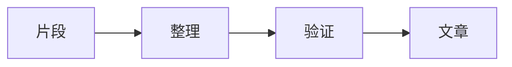

这是这个博客的第一篇文章。

我会把值得反复翻看的内容写在这里：技术实践、阅读笔记，以及日常生活中逐渐成形的想法。文章不追求固定长度，重点是把问题、过程和结论交代清楚。

## 我会怎样更新

- 技术文章会保留可复现的步骤与代码
- 阅读笔记会记录触动我的概念和具体出处
- 随笔会从一个明确的场景或问题开始

## 内容示例

这里支持 Markdown、公式与 Mermaid。比如，一个想法从记录走向文章的过程：

公式也可以直接书写：

$$
e^{i\pi}+1=0
$$

下一篇，从一个真正想解决的问题开始。
